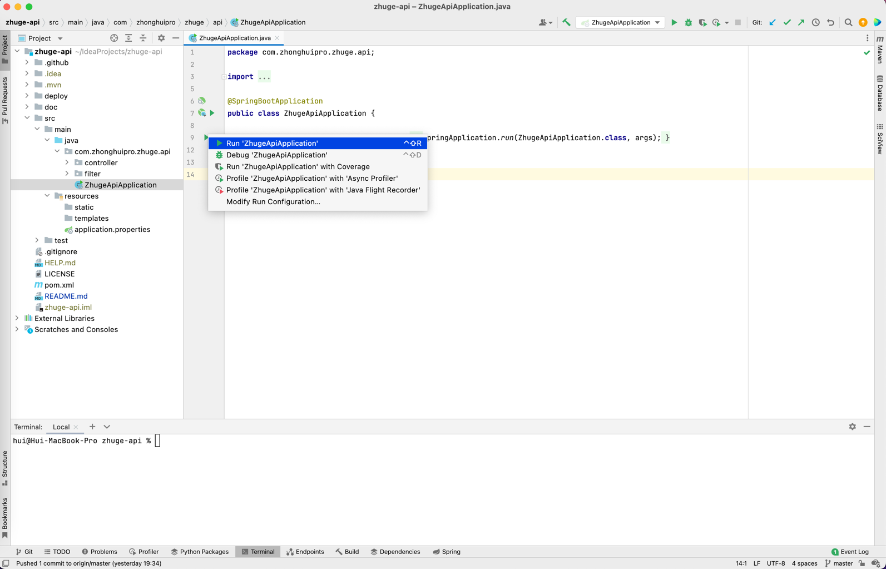

# zhuge-api

#### 介绍
诸葛系统后端项目

#### 软件架构
软件架构说明


#### 安装教程

1. 运行环境：Java 1.8
2. 编程环境：IDEA 2022
3. 参考视频教程《码上入职课》
["1.1.2.1 Java后端-环境安装"](https://mashangxue.feishu.cn/wiki/wikcn2v6OO6oG33qiHDtLPOEeZW)

#### 使用说明

1. IDEA运行
   1. 视频教程参见《码上入职课》
      1. ["1.1.3 Java后端-本机跑HelloWorld"](https://mashangxue.feishu.cn/wiki/wikcn7zTCgGHBYTdwUN9uXIo5ag)
      2. ["1.1.11 Java后端-后端框架Spring"](https://mashangxue.feishu.cn/wiki/wikcn7zTCgGHBYTdwUN9uXIo5ag)
   2. 打开 com.zhonghuipro.zhuge.api.ZhugeApiApplication.java
   3. 运行main函数（快捷键 macOS：^+shift+R，或点main函数旁边小绿三角形）
   
   
2. 命令行运行
   ```shell
   mvn -B clean package -Dmaven.test.skip=true
   java -jar target/zhuge-api-0.0.1-SNAPSHOT.jar
   ```

#### 参与贡献

1.  Fork 本仓库
2.  新建 feature_xxx 分支
3.  提交代码
4.  新建 Pull Request
